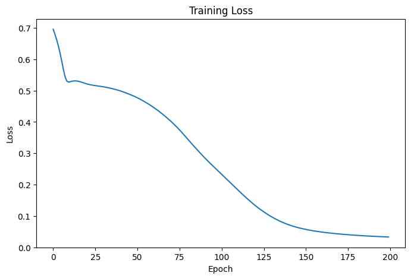
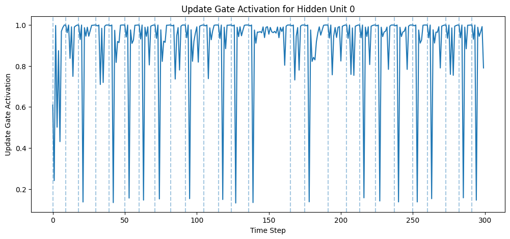
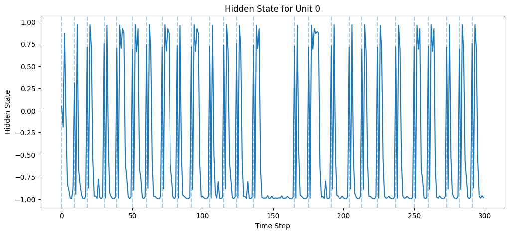

# Learning Phrase Representations using RNN Encoder-Decoder — GRU Architecture Replication from Scratch

This repository is a beginner-friendly architecture-level replication of the gated recurrent unit introduced in the paper:

**Paper:** *Learning Phrase Representations using RNN Encoder–Decoder for Statistical Machine Translation*  
**Authors:** Kyunghyun Cho, Bart van Merrienboer, Caglar Gulcehre, Dzmitry Bahdanau, Fethi Bougares, Holger Schwenk, Yoshua Bengio  
**Year:** 2014  
**arXiv:** 1406.1078  

The paper proposes an RNN Encoder–Decoder model and introduces a simpler gated recurrent hidden unit that later became widely known as the **GRU**.

This project implements the GRU architecture manually using **PyTorch from scratch**, without using PyTorch's built-in:

```python
nn.GRU
nn.RNN
nn.LSTM
```

A major contribution of the paper is the gated recurrent hidden unit, which uses:

```text
Reset Gate
Update Gate
Candidate Hidden State
Final Hidden State
```

The goal of the gated unit is to make recurrent networks easier to train and better at remembering or forgetting information over time.

---

## Repository Goal

The goal of this repository is to understand and implement the GRU hidden unit from scratch.

This project focuses on:

- understanding the GRU equations
- manually implementing reset and update gates
- building a custom GRU block
- building a custom GRU sequence model
- generating the Reber Grammar dataset
- training the GRU for next-symbol prediction
- visualizing reset gate activations
- visualizing update gate activations
- visualizing hidden states

This is an **architecture-level replication**, not a full reproduction of the original statistical machine translation system.

---

## Important Simplification

The original paper used an RNN Encoder–Decoder for English–French phrase translation and phrase-table scoring in statistical machine translation.

This project does **not** reproduce the full SMT pipeline.

Instead, it focuses on the main recurrent architecture contribution:

```text
GRU hidden unit from scratch
```

To make the implementation beginner-friendly, this project uses the **Reber Grammar next-symbol prediction task**, similar to classic recurrent network experiments.

---

## Main Idea of GRU

A normal RNN updates its hidden state like this:

```text
h_t = tanh(Wx_t + Uh_(t-1))
```

This simple update can struggle with long-term dependencies because it does not explicitly control what to remember and what to forget.

GRU improves this by using gates.

The two main gates are:

```text
Reset Gate
Update Gate
```

The reset gate decides how much previous hidden information should be ignored while computing the candidate hidden state.

The update gate decides how much new candidate information should be used in the final hidden state.

---

## GRU Equations

In this implementation, the GRU equations are written as:

```text
r_t = sigmoid(W_r [x_t, h_(t-1)])
```

```text
z_t = sigmoid(W_z [x_t, h_(t-1)])
```

```text
h_bar_t = tanh(W_h [r_t * h_(t-1), x_t])
```

```text
h_t = (1 - z_t) * h_(t-1) + z_t * h_bar_t
```

Where:

| Symbol | Meaning |
|---|---|
| `x_t` | Current input |
| `h_t_1` | Previous hidden state |
| `r_t` | Reset gate |
| `z_t` | Update gate |
| `h_t_bar` | Candidate hidden state |
| `h_t` | New hidden state |

Note:

Some papers write the update equation as:

```text
h_t = z_t * h_(t_1) + (1 - z_t) * h_t_bar
```

This project follows the common implementation convention where `z_t` controls how much candidate hidden state is used.

The core idea remains the same:

```text
GRU learns how much old memory to keep and how much new information to add.
```

---

## Implemented Architecture

The model is implemented manually using PyTorch modules.

The main classes are:

```text
GRUBlock
GRU
```

This project does **not** use:

```python
nn.GRU
nn.RNN
nn.LSTM
```

The goal is to understand the internal working of GRU gates.

---

## Architecture Flow

```text
                    Current input x_t
                           ↓
              Concatenate with h_(t-1)
                           ↓
        ┌──────────────────┴──────────────────┐
        ↓                                     ↓
   Reset Gate                             Update Gate
        ↓                                     ↓
       r_t                                   z_t
        ↓
r_t * h_(t-1)
        ↓
Candidate Hidden State h_bar_t
        ↓
h_t = (1 - z_t) * h_(t-1) + z_t * h_bar_t
        ↓
Linear Output Layer
        ↓
Prediction of next symbol
```

For a sequence:

```text
x1 + h0 → h1 → y1
x2 + h1 → h2 → y2
x3 + h2 → h3 → y3
...
```

Unlike LSTM, GRU does not have a separate cell state.

GRU only maintains:

```text
hidden state h_t
```

---

## Dataset: Reber Grammar

This project uses the Reber Grammar next-symbol prediction task.

Reber Grammar is a synthetic grammar dataset used to test whether recurrent models can learn sequence rules.

The symbols used are:

```text
B, T, P, S, X, V, E
```

So:

| Item | Value |
|---|---|
| Input size | 7 |
| Output size | 7 |
| Input representation | One-hot vector |
| Target representation | Multi-hot vector |


---

## Project Structure

```text
GRU-Architecture-Replication/
│
├── Notebooks/
│   └── Gated_Recurrent_Unit.ipynb
│
├── Images/
│   ├── training_loss.png
│   ├── reset_gate_activation.png
│   ├── update_gate_activation.png
│   └── hidden_state.png
│
└── README.md
```

---

## Parameters

| Parameter | Value |
|---|---|
| Input size | 7 |
| Output size | 7 |
| Hidden size | 8 |
| Loss function | BCEWithLogitsLoss |
| Optimizer | Adam |
| Learning rate | 0.001 |
| Epochs | 200 |
| Train sequences | 3000 |
| Test sequences | 500 |
| Dataset | Reber Grammar |

---

## Training

The model receives the full sequence in time order.

At each time step:

```text
current input symbol → GRUBlock → hidden state → output layer → prediction
```

The hidden state is passed from one time step to the next.

This allows the model to remember previous symbols and use them to predict valid next symbols.

---

## Evaluation

The model is evaluated using:

```text
Test Loss
Exact-Match Accuracy
Predicted Target vs Actual Target
```

Exact-match accuracy checks whether the full predicted multi-hot vector exactly matches the target vector.

Example correct:

```text
Actual:    ['T', 'P']
Predicted: ['T', 'P']
```

Example incorrect:

```text
Actual:    ['T', 'P']
Predicted: ['P']
```

Even though `P` is partly correct, it is counted as incorrect because exact match requires all valid next symbols to be predicted.

---

## Results

Initial result format:

```text
Test Loss: 0.0327
Exact Match Accuracy: 95.98%
```

Results may improve after:

- increasing epochs
- tuning learning rate
- increasing hidden size
- training on smaller data first to verify overfitting
- using sequence chunks instead of one very long stream
- adjusting the prediction threshold
- plotting gate activations to inspect learning behavior

---

## Training Loss Plot

The training loss curve shows whether the model is learning over epochs.

Expected behavior:

```text
loss should generally decrease over time
```



---

## Update Gate Visualization

The update gate controls how much the hidden state is updated with new candidate information.

Expected behavior:

```text
update gate near 0 → keep more old hidden state
update gate near 1 → use more candidate hidden state
```



---

## Hidden State Visualization

The hidden state plot helps show how the GRU memory changes over time.

Unlike LSTM, GRU does not have a separate cell state.

The hidden state itself acts as the memory.



---

## Difference Between LSTM and GRU

| Feature | LSTM | GRU |
|---|---|---|
| Main memory | Cell state + hidden state | Hidden state only |
| Gates | Input, Forget, Output | Reset, Update |
| Cell state | Yes | No |
| Simpler architecture | No | Yes |
| Built-in forgetting | Forget gate | Update/reset gates |

GRU is simpler than LSTM because it removes the separate cell state and combines memory control into fewer gates.

---

## Conclusion

This repository implements a simplified architecture-level replication of the gated recurrent unit introduced in:

```text
Learning Phrase Representations using RNN Encoder–Decoder for Statistical Machine Translation
```

The central idea is:

```text
A recurrent model should learn how much past information to keep
and how much new information to use.
```

GRU makes this possible using:

```text
Reset Gate
Update Gate
Candidate Hidden State
Hidden State Update
```

This project demonstrates the internal working of GRU by implementing the gates manually and training the model on the Reber Grammar next-symbol prediction task.

---

## Author

**BY: SUBHAM MOHANTY**
