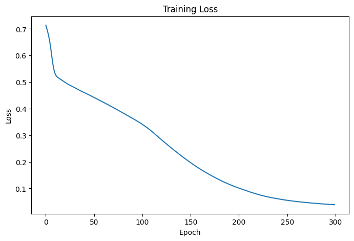
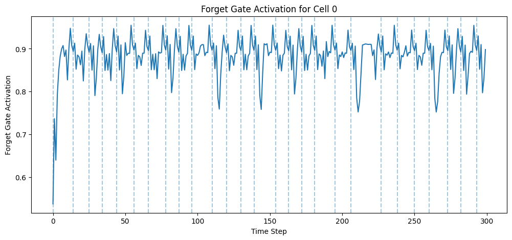
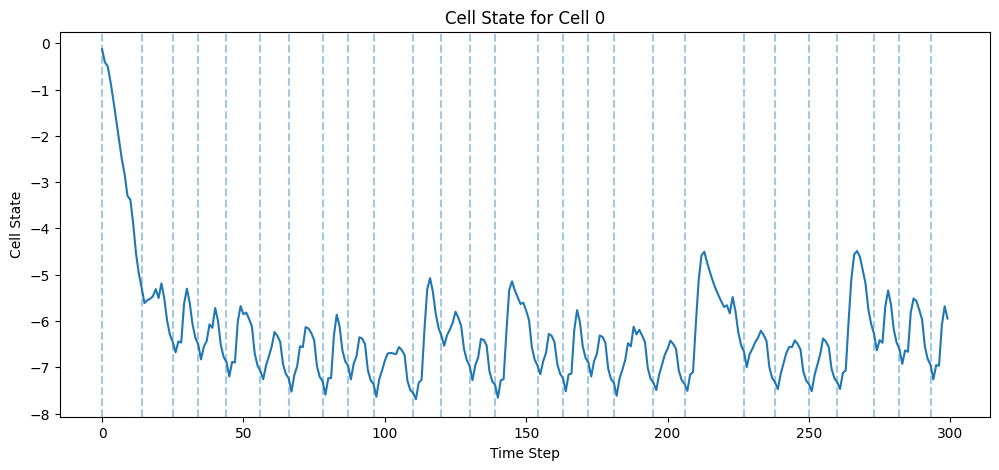

# Learning to Forget: Continual Prediction with LSTM — Paper Replication from Scratch

This repository is a beginner-friendly paper replication of the classic LSTM paper:

**Paper:** *Learning to Forget: Continual Prediction with LSTM*  
**Authors:** Felix A. Gers, Jürgen Schmidhuber, Fred Cummins  
**Year:** 1999  
**Technical Report:** IDSIA-01-99  

The paper introduces one of the most important improvements to the original LSTM architecture:

```text
Forget Gate
```

The main idea is simple:

```text
LSTM should not only learn to remember.
It should also learn when to forget.
```

This project implements a simplified version of the forget-gate LSTM architecture using **PyTorch from scratch**, without using PyTorch's built-in `nn.LSTM`.

---

## About the Paper

Recurrent Neural Networks are used for sequence data such as:

- text
- speech
- time series
- grammar sequences
- continuous symbol streams

Normal RNNs struggle with long-term dependencies because of the **vanishing gradient problem** and **exploding gradient problem**.

The original LSTM solved this by using a memory cell that can store information for a long time.

However, this paper identifies a new problem:

```text
If the input stream is continuous and the network is not manually reset,
the LSTM cell state can grow too much and eventually fail.
```

So the authors introduce the **forget gate**.

The forget gate allows the LSTM to decide:

```text
keep old memory
remove old memory
partially reduce old memory
```

---

## Repository Goal

The goal of this repository is to understand and implement the forget-gate LSTM architecture from scratch.

This project focuses on:

- understanding the paper step by step
- generating the Continual Embedded Reber Grammar dataset
- manually implementing LSTM gates
- implementing the forget gate update equation
- training the model for next-symbol prediction
- visualizing forget gate activations
- visualizing cell states

This is an **architecture-level replication**, not a full exact reproduction of all paper experiments.

---

## Main Idea of the Paper

In the old LSTM, the cell state update was:

```text
c_t = c_(t-1) + input_gate * candidate_memory
```

This means the previous memory is always kept.

The paper changes this by adding a forget gate:

```text
c_t = forget_gate * c_(t-1) + input_gate * candidate_memory
```

In code-like form:

```python
c_t = f_t * c_prev + i_t * c_bar
```

Where:

| Symbol | Meaning |
|---|---|
| `f_t` | Forget gate |
| `c_prev` | Previous cell state |
| `i_t` | Input gate |
| `c_bar` | Candidate memory |
| `c_t` | New cell state |
---

## Implemented Architecture

The model is implemented manually using PyTorch modules.

The main classes are:

```text
ForgetGate
InputGate
OutputGate
LSTMBlock
LSTM
```

This project does **not** use:

```python
nn.LSTM
nn.RNN
nn.GRU
```

The goal is to understand the internal working of LSTM gates.

---


## Architecture Flow

```text
                    Current input x_t
                           ↓
              Concatenate with h_(t-1)
                           ↓
        ┌──────────────────┼──────────────────┐
        ↓                  ↓                  ↓
   Forget Gate        Input Gate         Output Gate
        ↓                  ↓                  ↓
       f_t                i_t                o_t
                           ↓
                  Candidate Memory c_bar
                           ↓
        c_t = f_t * c_(t-1) + i_t * c_bar
                           ↓
                  h_t = o_t * tanh(c_t)
                           ↓
                    Linear Output Layer
                           ↓
                  Prediction of next symbol
```

For a sequence:

```text
x1 + h0 + c0 → h1 + c1 → y1
x2 + h1 + c1 → h2 + c2 → y2
x3 + h2 + c2 → h3 + c3 → y3
...
```

---

## Dataset: Continual Embedded Reber Grammar

The paper uses a grammar-based sequence prediction task called **Embedded Reber Grammar** and converts it into a continual version.

This project generates the dataset manually using graph transition rules.

The symbols used are:

```text
B, T, P, S, X, V, E
```

So:

| Item | Value |
|---|---|
| Input size | 7 |
| Output size | 7 |
| Input representation | One-hot vector |
| Target representation | Multi-hot vector |

---

## Dataset Generation Pipeline

```text
1. Generate Standard Reber Grammar strings
2. Wrap each string to create Embedded Reber Grammar
3. Join embedded strings to create a continual stream
4. Create input-target pairs
5. One-hot encode inputs
6. Multi-hot encode targets
7. Convert encoded data into PyTorch tensors
```

---

## Project Structure

```text
Learning-to-Forget-LSTM-Replication/
│
├── Notebooks/
│   └── Reber_Grammar_Prediction.ipynb
│
├── Images/
│   ├── training_loss.png
│   ├── forget_gate_activation.png
│   └── cell_state.png
│
└── README.md
```

---

## Parameters

| Parameter | Value |
|---|---|
| Input size | 7 |
| Output size | 7 |
| Hidden size | 8 |
| Loss function | BCEWithLogitsLoss |
| Optimizer | Adam |
| Learning rate | 0.001 |
| Epochs | 50 |
| Train sequences | 3000 |
| Test sequences | 500 |
| Dataset | Continual Embedded Reber Grammar |

---

## Training

The model receives the full sequence in time order.

At each time step:

```text
current input symbol → LSTMBlock → hidden state → output layer → prediction
```

The hidden state and cell state are passed from one time step to the next.

This allows the model to remember previous symbols.

---

## Evaluation

The model is evaluated using:

```text
Test Loss
Exact-Match Accuracy
Predicted Target vs Actual Target
```

Exact-match accuracy checks whether the full predicted multi-hot vector exactly matches the target vector.

Example correct:

```text
Actual:    ['T', 'P']
Predicted: ['T', 'P']
```

Example incorrect:

```text
Actual:    ['T', 'P']
Predicted: ['P']
```

Even though `P` is partly correct, it is counted as incorrect because exact match requires all correct symbols.

---

## Results

Initial result format:

```text
Test Loss: 0.6678
Exact Match Accuracy: 4.20%
```

Note:

The above result was from an initial run. Results can improve after:

- fixing the training target
- increasing epochs
- tuning the learning rate
- increasing hidden size
- training on a smaller dataset first to verify overfitting
- using sequence chunks for more stable training

---

## Training Loss Plot

The training loss curve shows whether the model is learning over epochs.

Expected behavior:

```text
loss should generally decrease over time
```

Add your generated plot here:

```markdown

```

---

## Forget Gate Visualization

The forget gate is the main contribution of this paper.

Expected behavior:

```text
forget gate near 1 → keep memory
forget gate near 0 → forget/reset memory
```

Add your generated plot here:

```markdown

```

---

## Cell State Visualization

The cell state plot helps show how memory changes over time.

The paper explains that without proper forgetting, cell states can grow too much in continual streams.

With forget gates, the model can learn to reset or reduce memory when needed.

Add your generated plot here:

```markdown

```

---

## Conclusion

This repository implements a simplified replication of the forget-gate LSTM architecture from:

```text
Learning to Forget: Continual Prediction with LSTM
```

The central idea is:

```text
A recurrent model should not only remember useful information.
It should also learn when old information is no longer needed.
```

The forget gate makes this possible using the equation:

```text
c_t = f_t * c_(t-1) + i_t * c_bar
```

This allows the LSTM to process continuous streams more effectively by learning memory resets internally.

---

## Author

**BY: SUBHAM MOHANTY**
